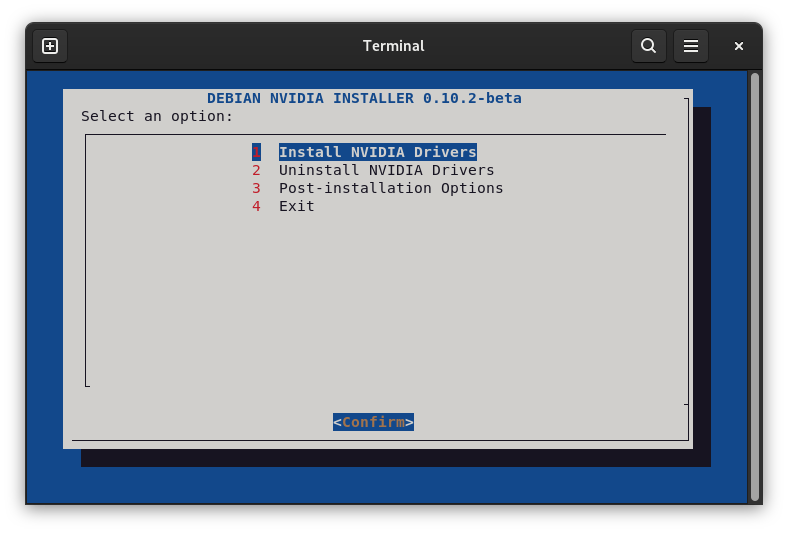
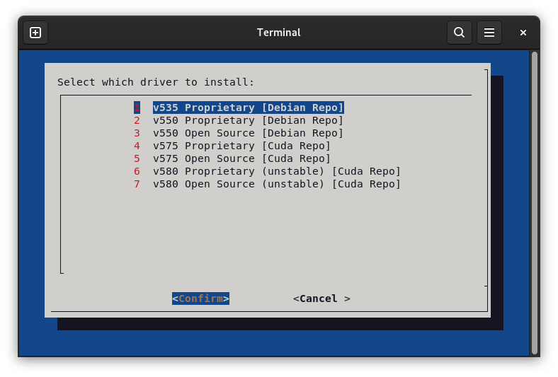
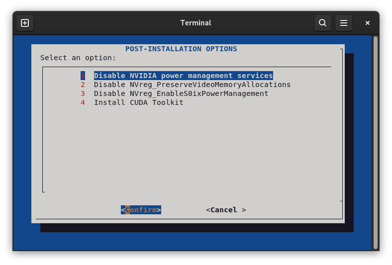
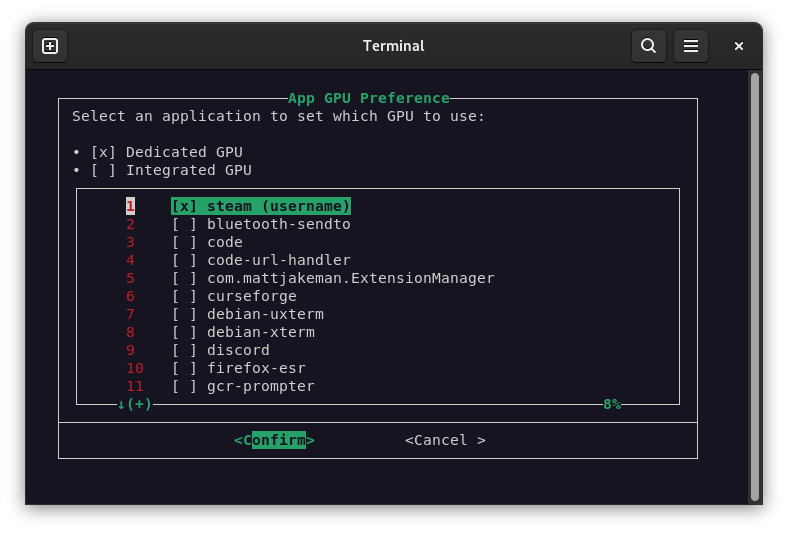

# debian-nvidia-installer

NVIDIA driver installer with a Bash TUI. This tool allows you to install NVIDIA drivers on Debian using an interactive text-based interface (TUI).
It automates steps such as package installation, compatibility checks, and graphics environment configuration.



<div style="display:flex; gap:10px;">
  
  
  
</div>

### Requirements

* Debian Trixie distribution
* amd64 architecture
* Compatible NVIDIA graphics card
  > Official NVIDIA drivers on Debian Trixie do not support [GPUs based on the Fermi or Kepler architecture](https://www.nvidia.com/en-us/drivers/unix/legacy-gpu/).

  > See [Debian’s guide on installing legacy drivers](https://wiki.debian.org/NvidiaGraphicsDrivers#Tesla_Drivers) if needed.
* Bash-compatible shell
* Administrator privileges (sudo/root)

# How to Run

After installation, you can start the script through the shortcut in the applications menu or via the terminal by running the command:

```bash
sudo debian-nvidia-installer
```
> ⚠️ **It is necessary to run as root**, as the tool makes system changes such as installing packages and modifying configuration files.

# Installation

You can install `debian-nvidia-installer` by downloading the `.deb` package from the **[Releases](https://github.com/devleonardoamaral/debian-nvidia-installer/releases)** section of this repository.

### Option 1: Graphical Interface

1. Download the `.deb` package.
2. **Double-click** the file to open it with your system's package manager.
3. Click **“Install”**. You may be prompted to enter your administrator password.

> 💡 Compatible with package managers such as GDebi, Discover (KDE), GNOME Software, and similar tools.

### Option 2: Terminal

Before starting, check the version of the `.deb` package you downloaded from GitHub. Replace `X.X.X` in the commands below with the correct version.
For example, if the version is `0.0.1`, the file will be `debian-nvidia-installer_0.0.1_amd64.deb`.

Copy the `.deb` file to the `/tmp` directory to avoid permission issues with the system package manager:

```bash
cp ./debian-nvidia-installer_X.X.X_amd64.deb /tmp/
```

> 💡 Files in the `/tmp` directory are automatically removed after a system reboot.

Change to the temporary directory `/tmp`, where the `.deb` file was moved:

```bash
cd /tmp
```

Install the package using `apt` so that the script dependencies are installed correctly:

```bash
sudo apt install ./debian-nvidia-installer_X.X.X_amd64.deb
```

> ⚠️ **Important:** Do not install using `dpkg -i`, as this will not resolve the package dependencies and the package may break.

### Option 3: Build and install manually (for advanced users)

Clone the repository locally on your computer using [git](https://packages.debian.org/stable/git):

```bash
git clone https://github.com/devleonardoamaral/debian-nvidia-installer.git
```

Change to the cloned repository directory:

```bash
cd debian-nvidia-installer
```

Run the build script provided in the repository. It will create the `.deb` package in `./deb_build/debian-nvidia-installer_X.X.X_amd64.deb`:

```bash
./build_deb.sh
```

To install the `.deb` package, follow the same steps as in [Option 1: Graphical Interface](#option-1-graphical-interface) or [Option 2: Terminal](#option-2-terminal).

# Uninstallation

To completely remove the script and its dependencies, run the following command:

```bash
sudo apt purge --autoremove debian-nvidia-installer
```

---

Para a versão em **Português do Brasil**, veja [README.pt_BR.md](README.pt_BR.md)

---
.
> ```
> Hello, Debians!
>
> I created this script because I genuinely wanted to contribute to the Linux community, especially to Debian users. I know that moving to Debian can be challenging, particularly for those with NVIDIA hardware, and setting up the drivers correctly is often confusing and intimidating. My goal was to make this process simpler, more accessible, and less stressful for anyone going through it.
>
> Working on this script was also a personal journey for me. It was an opportunity to dive deeper into Linux, understand how the system works under the hood, and explore Bash in a practical way. Sharing the project on GitHub felt like a natural step—not only so others can use it, but also so anyone interested can learn, suggest improvements, and contribute. I hope it helps users, encourages collaboration, and strengthens knowledge sharing within the community.
>```